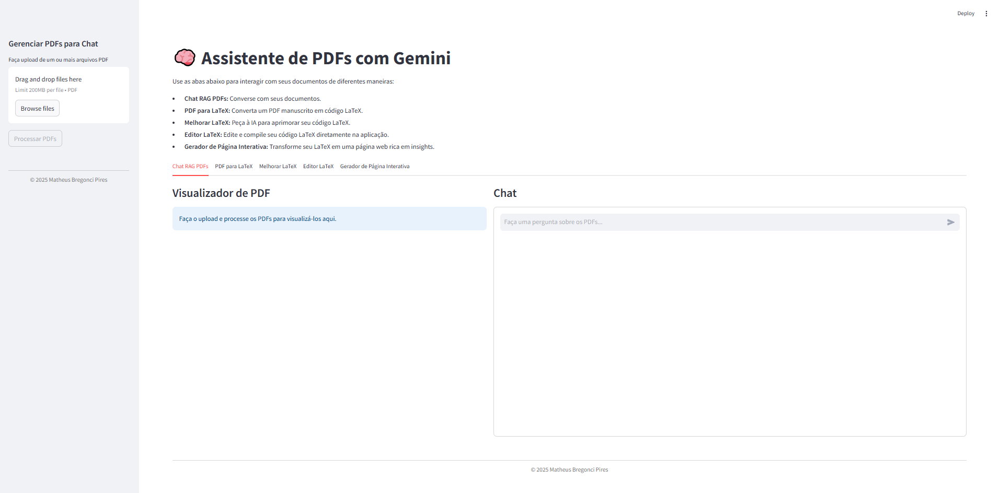
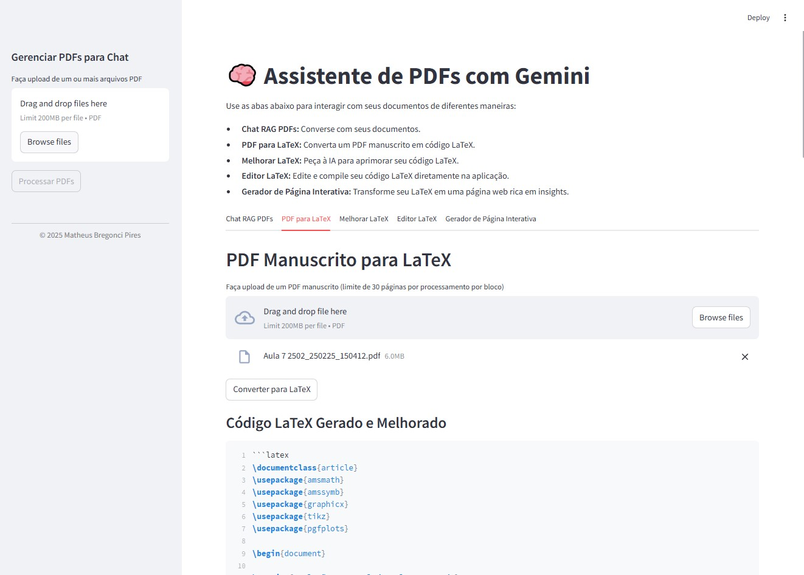
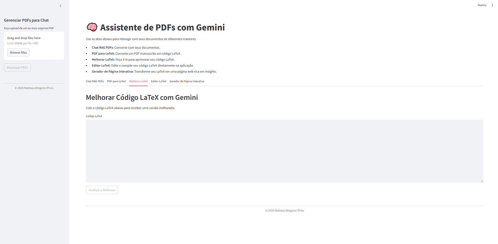
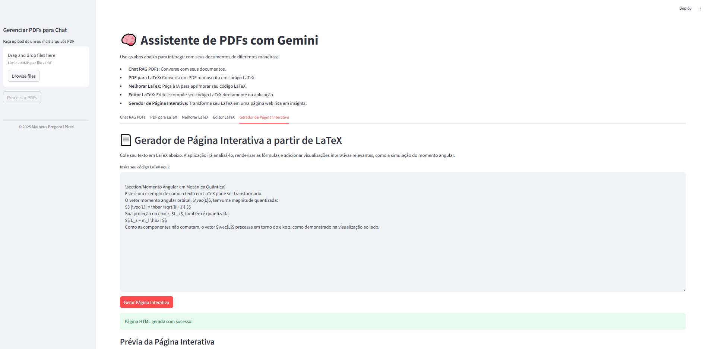

# Assistente de PDFs com Gemini 📚

Bem-vindo ao **Assistente de PDFs com Gemini**! Esta aplicação Streamlit aprimorada oferece um conjunto de ferramentas poderosas para interagir com seus documentos PDF e código LaTeX, utilizando os recursos avançados da IA Gemini.

## 🌟 Funcionalidades

Este assistente permite que você:

1.  **Converse com PDFs (RAG):** Faça upload de múltiplos PDFs e interaja com um chatbot inteligente que responde a perguntas baseadas no conteúdo dos seus documentos.
     2.  **PDF Manuscrito para LaTeX:** Converta PDFs contendo notas manuscritas e fórmulas matemáticas em código LaTeX editável. Ideal para digitalizar seus rascunhos acadêmicos!
     3.  **Melhoria de Código LaTeX:** Obtenha sugestões e melhorias da IA Gemini para o seu código LaTeX existente, visando clareza, estrutura e formatação.
     4.  **Editor LaTeX Online:** Um ambiente completo de IDE com editor de código e visualizador de PDF lado a lado para compilar e pré-visualizar seu LaTeX em tempo real.
     5.  **Gerador de Página Web Interativa:** Transforme seu código LaTeX em uma página web HTML interativa e moderna, com renderização de fórmulas e visualizações dinâmicas (como simulações de física!).
     
    
## 🚀 Como Rodar pela Primeira Vez

Siga estes passos para configurar e executar a aplicação em seu ambiente local.

### 1. Pré-requisitos

Antes de começar, certifique-se de ter o seguinte instalado em seu sistema:

* **Python 3.9+**:
    * Verifique sua versão com: `python --version` ou `python3 --version`.
    * Se precisar instalar, visite [python.org](https://www.python.org/downloads/).
* **Git** (Opcional, mas recomendado para clonar o repositório):
    * Verifique com: `git --version`.
    * Baixe em [git-scm.com](https://git-scm.com/downloads).
* **Uma distribuição LaTeX** (Obrigatório para a funcionalidade de compilação/edição LaTeX):
    * **Para Windows:** [MiKTeX](https://miktex.org/download)
    * **Para macOS:** [MacTeX](http://www.tug.org/mactex/download.html)
    * **Para Linux:** [TeX Live](https://www.tug.org/texlive/acquire-iso.html) (geralmente disponível via gerenciador de pacotes, ex: `sudo apt-get install texlive-full`)
    * **Importante:** Após a instalação do LaTeX, verifique se o comando `pdflatex` está disponível no seu PATH executando `pdflatex --version` no terminal. Se não estiver, adicione o diretório binário do LaTeX ao seu PATH.

### 2. Configuração do Projeto

1.  **Clone o Repositório (Recomendado):**
    Abra seu terminal ou prompt de comando e execute:
    ```bash
    git clone [https://github.com/SeuUsuario/rag-latex-app.git](https://github.com/SeuUsuario/rag-latex-app.git)
    cd rag-latex-app
    ```
    (Substitua `https://github.com/SeuUsuario/rag-latex-app.git` pelo URL real do seu repositório, se estiver em um.)

    **Ou Baixe Manualmente:**
    Baixe o arquivo ZIP do repositório e extraia-o para uma pasta de sua escolha. Navegue até essa pasta no seu terminal.

2.  **Crie um Ambiente Virtual (Recomendado):**
    É uma boa prática isolar as dependências do seu projeto.
    ```bash
    python -m venv venv
    ```

3.  **Ative o Ambiente Virtual:**
    * **Windows:**
        ```bash
        .\venv\Scripts\activate
        ```
    * **macOS/Linux:**
        ```bash
        source venv/bin/activate
        ```
    Você verá `(venv)` no início da linha de comando, indicando que o ambiente está ativo.

4.  **Instale as Dependências:**
    Com o ambiente virtual ativado, instale todas as bibliotecas necessárias:
    ```bash
    pip install -r requirements.txt
    ```

5.  **Crie o Diretório de Dados:**
    Este diretório será usado para armazenar o banco de dados vetorial (`ChromaDB`).
    ```bash
    mkdir -p data/vectors
    ```

### 3. Configuração da Google API Key

Para usar os modelos Gemini (Google AI), você precisará de uma chave de API.

1.  **Obtenha sua Chave de API do Google AI Studio:**
    * Vá para a plataforma **Google AI Studio**: [https://aistudio.google.com/app/apikey](https://aistudio.google.com/app/apikey)
    * Se você já possui uma conta Google, faça login.
    * Na página de chaves de API, procure pela opção **"Create API Key in new project"** (Criar chave de API em novo projeto) ou **"Get API Key"** (Obter chave de API) se já tiver projetos existentes.
    * Clique no botão para gerar uma nova chave.
    * **Copie a chave gerada**. Ela será uma string alfanumérica longa. **Guarde-a em um local seguro**, pois você não poderá vê-la novamente por completo após sair da página.

2.  **Configure a Chave no Streamlit:**
    Para que sua aplicação Streamlit possa acessar a chave de API de forma segura, você deve armazená-la em um arquivo de segredos.

    * Na raiz do seu projeto (`rag-latex-app/`), crie uma pasta chamada `.streamlit` (se ainda não existir).
    * Dentro da pasta `.streamlit/`, crie um arquivo chamado `secrets.toml`:

        ```
        rag-latex-app/
        ├── .streamlit/
        │   └── secrets.toml  <-- Crie este arquivo
        └── ...
        ```

    * Abra o arquivo `secrets.toml` recém-criado e adicione sua chave de API desta forma:
        ```toml
        GOOGLE_API_KEY="SUA_CHAVE_API_AQUI"
        ```
        **Lembre-se de substituir `SUA_CHAVE_API_AQUI` pela sua chave real que você copiou.**

    * **Alternativa (menos recomendada para produção):** Se você preferir não usar o arquivo `secrets.toml` inicialmente, a aplicação Streamlit irá solicitar a chave de API em um campo de texto na barra lateral quando você a iniciar pela primeira vez.

### 4. Executando a Aplicação

Com todas as configurações feitas, você está pronto para rodar a aplicação!

1.  Certifique-se de que seu ambiente virtual ainda está ativo.
2.  No terminal (na pasta `rag-latex-app`), execute o comando:
    ```bash
    streamlit run src/app.py
    ```

3.  Uma nova aba será aberta automaticamente no seu navegador padrão, exibindo a interface do Streamlit. Se não abrir, verifique o terminal; ele fornecerá um URL (geralmente `http://localhost:8501`) que você pode copiar e colar manualmente no seu navegador.

## 💡 Dicas de Uso

* **Chat RAG PDFs:** Faça upload de seus documentos e clique em "Processar PDFs". Uma vez processados, você pode digitar suas perguntas no chat.
* **PDF para LaTeX:** Faça upload de um PDF manuscrito (idealmente com texto claro) e clique em "Converter para LaTeX".
* **Melhorar LaTeX:** Cole seu código LaTeX no editor e clique em "Analisar e Melhorar".
* **Editor LaTeX:** Escreva ou cole seu código LaTeX no editor à esquerda e clique em "Compilar para PDF" para ver o resultado à direita. Você pode ajustar o zoom e baixar o PDF gerado.
* **Gerador de Página Interativa:** Cole o código LaTeX para que a IA o transforme em uma página web interativa com visualizações.

## 🧹 Limpeza

Se precisar limpar o banco de dados vetorial para reindexar PDFs ou apenas liberar espaço, você pode:
* Usar o botão "⚠️ Limpar Base de Dados" na aba "Chat RAG PDFs".
* Excluir manualmente a pasta `data/vectors/` na raiz do seu projeto.

---

Esperamos que você aproveite o Assistente de PDFs com Gemini! Se tiver alguma dúvida ou encontrar problemas, sinta-se à vontade para abrir uma issue no repositório.